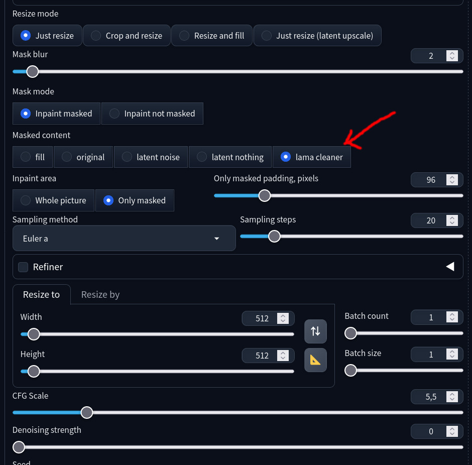
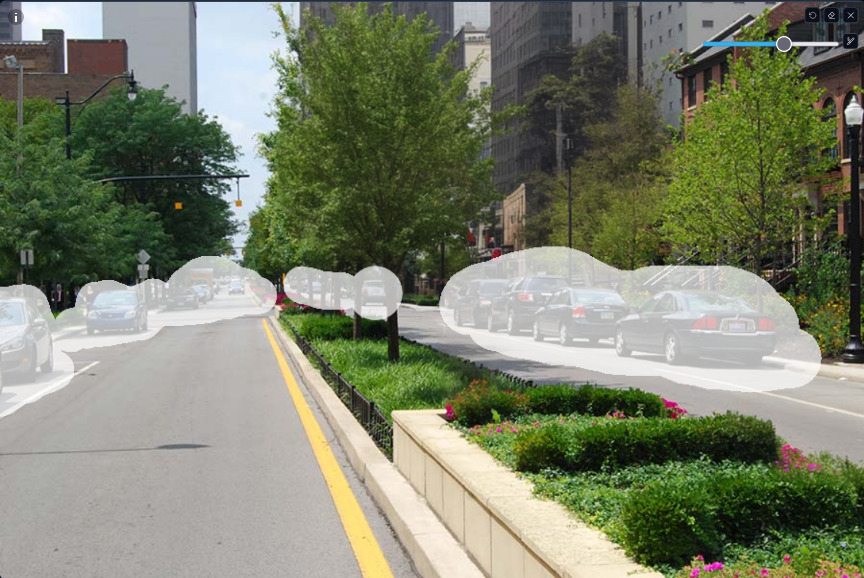
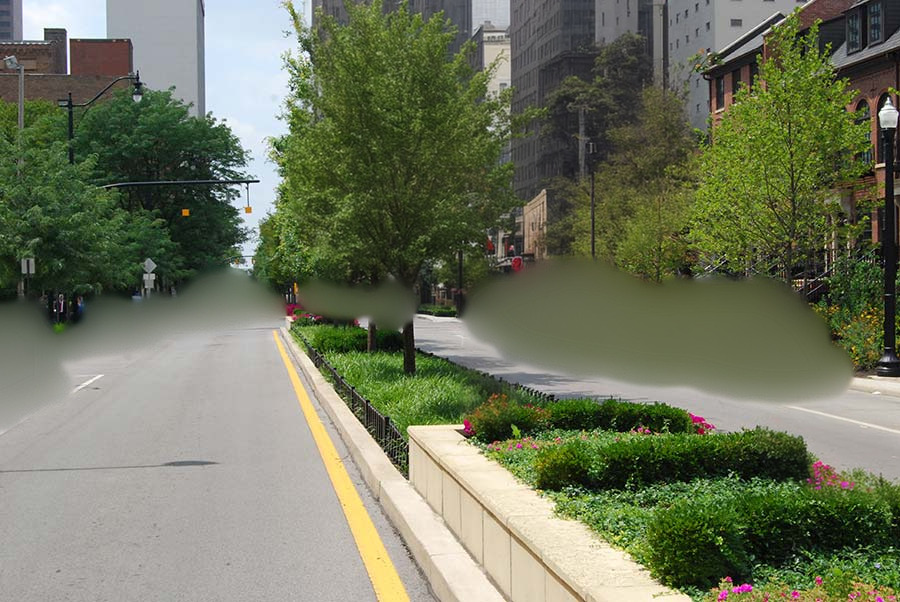
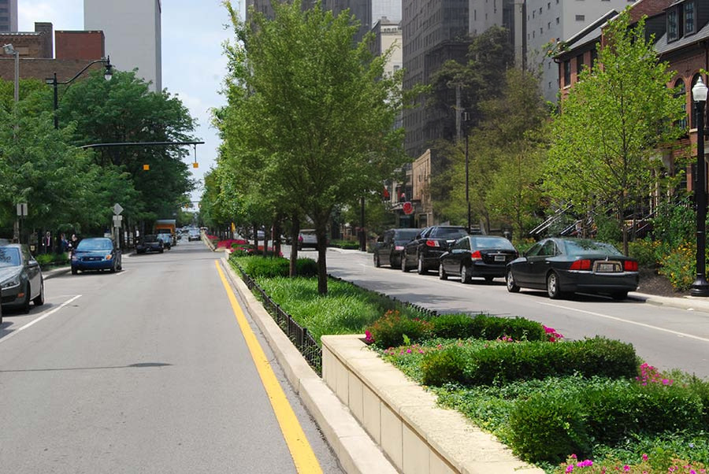
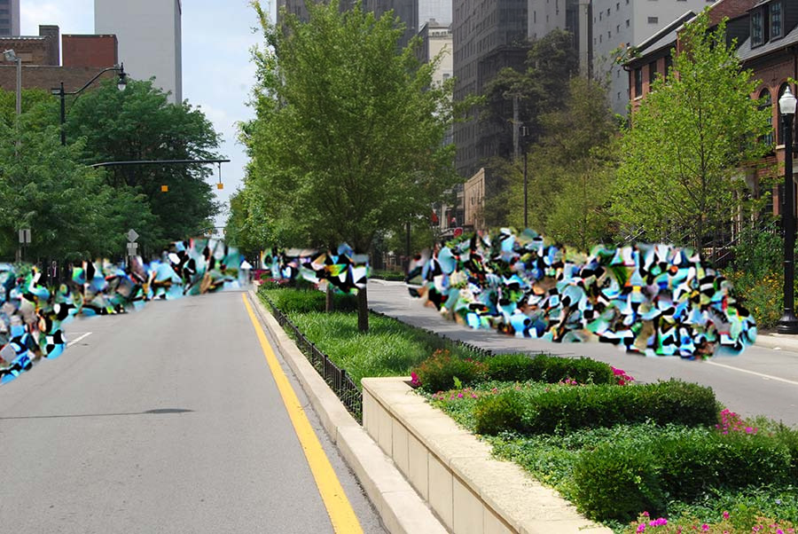
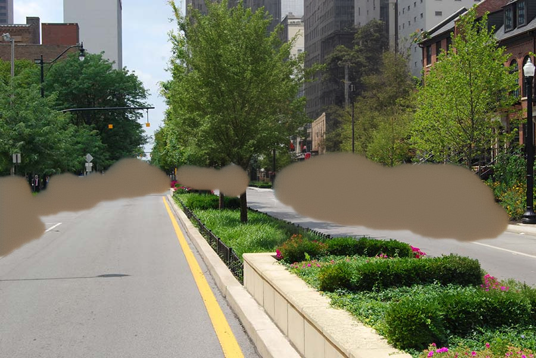
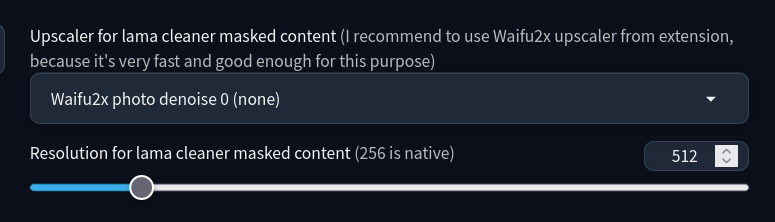

# Lama cleaner as masked content

This extenstion for [AUTOMATIC1111/stable-diffusion-webui](https://github.com/AUTOMATIC1111/stable-diffusion-webui) adds new value of "Masked content" field in img2img -> inpaint tab. Lama is a NN model useful for removing objects from pictures

This option means how to preprocess masked content before pass it into stable diffusion. It useful when you want to remove object in photo. Use inpainting model and denoising straight +-0.4

It also supports my other extension: [sd-webui-replacer](https://github.com/light-and-ray/sd-webui-replacer)

Mask:

lama cleaner:

fill:

Others

original:

latent noise:

latent nothing:

Also you can use Lama cleaner in extras tab, if you want to use it without stable diffusion:

If you have installed this extensions, they appear as models here:
- https://github.com/light-and-ray/sd-webui-resynthesizer-masked-content
- https://github.com/light-and-ray/sd-webui-yandere-inpaint-masked-content
- https://github.com/light-and-ray/sd-webui-manga-inpainting

- \+ MAT - another NN inpaint model
- \+ inpainting from OpenCV as bonus
- "Insert background" inserts image into target image. Useful for massive compositing in batch

## Options

You can adjust few settings:

Go to Settings -> Extras Inpaint:

<!-- Default upscaler is `ESRGAN_4x`. I recommend to use span upscalers e.g. [4x-Nomos8k-span-otf-medium](https://openmodeldb.info/models/4x-Nomos8k-span-otf-medium), because they work instantly and show amazing results -->

Native lama's dataset resolution is 256p, but it shows good result for highers with little quality of content reduction. 512p is optimal

