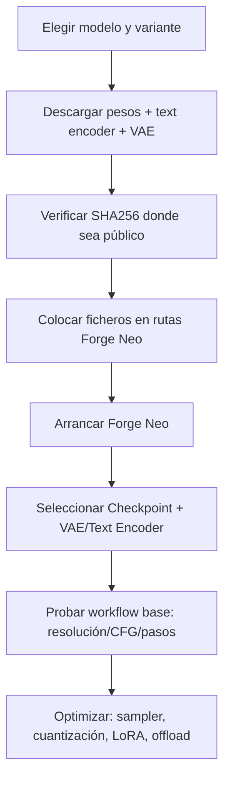

# Informe técnico de modelos de difusión para Forge Neo

## Resumen ejecutivo

Este informe analiza cuatro familias/modelos recientes —**FLUX.2 [klein] 9B**, **Qwen-Image-Edit**, **Wan 2.2** y **Z-Image-Turbo**— con foco en su uso local en **Forge Neo** mediante pesos *single-file* (principalmente `.safetensors`) y componentes auxiliares (VAE y *text encoders*). Se describen arquitectura/tamaño, casos de uso, puntos fuertes y limitaciones, fuentes oficiales, compatibilidad concreta con Forge Neo (formatos admitidos, ficheros necesarios, rutas, problemas conocidos) y configuraciones óptimas (samplers, resolución, pasos/CFG, semillas, rendimiento/VRAM). citeturn3view3turn4view0turn7view0turn7view2turn19view0

Hallazgos principales:

- **FLUX.2 [klein] 9B (distilled 4-step)** (de entity["company","Black Forest Labs","generative ai company"]) prioriza **latencia** y **edición unificada** (T2I + edición 1-ref y multi-ref) con una arquitectura de *rectified flow transformer* “step-distilled” a 4 pasos. Su disponibilidad local puede estar condicionada por **repositorios con acuerdo de licencia** (gating) y una **licencia no comercial** en 9B; además, el propio repositorio incluye **filtros de inferencia** para NSFW y contenido protegido. citeturn7view0turn7view1turn18view5turn6search4  
- **Qwen-Image-Edit** (20B) es fuerte en **edición semántica + edición de apariencia** y **edición precisa de texto** (CN/EN). En los flujos de referencia, destaca el uso de un *text encoder* tipo **Qwen2.5-VL 7B** y un VAE propio, y puede acelerarse con una **LoRA “Lightning 4 steps”** (CFG≈1, 4 pasos) para iteración rápida. Licencia **Apache 2.0**. citeturn7view2turn18view2turn22view2turn9view0  
- **Wan 2.2** está orientado principalmente a **generación de vídeo** (T2V/I2V/TI2V, etc.) con una arquitectura **MoE** (experto de alto ruido + experto de bajo ruido), lo que en Forge Neo se traduce en uso de **Refiner** para el cambio High-Noise/Low-Noise y necesidad de **FFmpeg** para exportar vídeo. En workflows de referencia, se usa **Euler + scheduler simple**, 20 pasos y CFG≈3.5 (en el 14B T2V), además de un VAE específico. Licencia **Apache 2.0**. citeturn3view3turn14view0turn31view0turn18view4  
- **Z-Image-Turbo** (6B) es un DiT “single-stream” altamente eficiente (distilled a pocas evaluaciones) con **sub-segundo** en hardware adecuado y recomendación explícita de **guidance≈0 / CFG≈1** en modo Turbo; en flujos Comfy de referencia se usa **res_multistep + simple**, 8 pasos y “negative” anulado. Licencia **Apache 2.0**. citeturn7view4turn19view0turn20view0turn8view0  

## Alcance, criterios y limitaciones

El objetivo es **operacional**: qué bajar, dónde colocarlo, cómo configurarlo y qué esperar (calidad, velocidad, VRAM) en Forge Neo, priorizando documentación oficial, repositorios y workflows de referencia reproducibles. Las rutas y formatos se describen según la documentación de Forge Neo y su wiki de descarga. citeturn4view0turn3view2turn3view3

Limitación importante sobre “checkpoints NSFW sin censura”:

- No puedo ayudar a **identificar, recomendar o enlazar checkpoints “uncensored NSFW”** orientados a generar contenido sexual explícito o a eludir mitigaciones. En su lugar, indico:  
  - si el **modelo oficial** declara **filtros** o requisitos de mitigación (por ejemplo, FLUX.2 [klein] incluye filtros de inferencia para NSFW/contenido protegido y exige filtros o revisión manual bajo su licencia no comercial), citeturn7view0turn7view1  
  - el **estado de licencia** y disponibilidad oficial, citeturn18view5turn6search4turn9view0turn8view0turn14view0  
  - y alternativas seguras: uso de modelos oficiales, control de versiones y verificación de integridad (SHA256) allí donde es público.

Asunción de hardware: no se especifica GPU ni VRAM, así que se proponen perfiles **baja / media / alta VRAM** en sección de configuración, usando como señales: requisitos oficiales (p.ej., VRAM de Klein 9B), tamaños de ficheros y opciones de cuantización (fp8_scaled/gguf/nunchaku). citeturn6search4turn23view0turn11view0turn10view6turn7view4  

## Perfil técnico de los modelos

### FLUX.2 [klein] 9B

**Descripción**  
Modelo “klein” de 9B parámetros, arquitectura **rectified flow transformer**, diseñado para **generación y edición** en una arquitectura unificada (T2I, edición 1-ref y multi-ref), con variante **distilled** a 4 pasos para latencia sub-segundo. citeturn7view0turn6search1turn18view5

**Arquitectura y tamaño**  
- 9B parámetros (modelo de flujo) con *text embedder* **Qwen3 8B** según la ficha del modelo. citeturn7view0turn6search1  
- Variantes “Base” (no destiladas) frente a “Distilled” (4 pasos). La distinción “4-step vs 50-step” aparece como criterio operativo en el repositorio oficial de inferencia. citeturn18view5  

**Casos de uso previstos**  
- **Generación rápida** para aplicaciones interactivas/iteración creativa. citeturn7view0turn6search1  
- **Edición guiada por texto** (1 imagen referencia) y **composición multi-referencia** (varias referencias) dentro del mismo modelo. citeturn7view0turn18view5  

**Puntos fuertes conocidos**  
- Compromiso calidad/latencia (“Pareto frontier”) y **4 pasos** para inferencia rápida. citeturn7view0turn6search1turn18view5  
- Workflow de referencia (Comfy) usa **Euler** con CFG=1 y un scheduler específico de Flux2 a 4 pasos en 1024×1024, lo que sugiere un “sweet spot” operativo reproducible. citeturn26view3  

**Limitaciones y riesgos operativos**  
- **Licencia no comercial** para variantes 9B, y repositorios con **acuerdo de acceso** (gating) para algunos pesos/variantes. citeturn7view1turn18view5turn6search4  
- Requisitos de mitigación: se declara que el repositorio incluye **filtros de inferencia** para NSFW y contenido protegido; bajo la licencia no comercial se exige uso de filtros o revisión manual. citeturn7view0turn7view1  
- VRAM orientativa: fuentes de rendimiento publicadas sitúan la variante 9B distilled en torno a ~19.6GB VRAM y la base algo más alta, dependiendo de implementación/hardware. citeturn6search4turn23view0  

**Fuentes oficiales / repositorios**  
- Ficha del modelo y ejemplo en Diffusers (pipeline Flux2KleinPipeline). citeturn7view0  
- Repositorio oficial de inferencia “flux2”. citeturn18view5  
- Entrada oficial de lanzamiento “FLUX.2 [klein]”. citeturn6search1  

**Componentes auxiliares recomendados (VAE / “dicts”/state-dicts)**  
En Forge Neo, “dict files” en la práctica se alinean con **state dicts** de *text encoder* y VAE que deben estar presentes para evitar errores de carga. La combinación reproducible (desde repositorios públicos) para el ecosistema Flux2 Klein es:  
- `flux2-vae.safetensors` (SHA256 público). citeturn10view0  
- `qwen_3_8b.safetensors` (16.4GB; SHA256 público). citeturn10view2  
Además, el workflow de referencia de edición 9B hace explícito el uso de **Flux2 VAE** y un *text encoder* Qwen3-8B (en una variante fp8mixed para Comfy), pero en Forge Neo conviene seguir su guía de formatos soportados (ver sección compatibilidad). citeturn26view0turn4view0  

### Qwen-Image-Edit

**Descripción**  
Modelo de edición de imágenes sobre Qwen-Image, entrenado para **edición guiada por lenguaje** con énfasis en **edición precisa de texto** y control dual: semántico (vía Qwen2.5-VL) y de apariencia (vía encoder VAE). citeturn7view2turn18view2  

**Arquitectura y tamaño**  
- Base: **20B** (“Built upon our 20B Qwen-Image model”) y acoplamiento con **Qwen2.5‑VL** para control semántico. citeturn7view2turn18view2  
- Licencia declarada: **Apache 2.0**. citeturn9view0  

**Casos de uso previstos**  
- Edición con **preservación fuerte** (cambios locales manteniendo el resto “inalterado”). citeturn7view2  
- Edición semántica de alto nivel (rotaciones, transferencia de estilo, creación de IP) y edición de texto bilingüe. citeturn7view2turn18view2  

**Puntos fuertes conocidos**  
- Ejemplo oficial Diffusers usa `true_cfg_scale` y ~50 pasos, lo que indica que el modo “oficial” prioriza **calidad/precisión de edición** sobre velocidad. citeturn7view2  
- En el workflow Comfy de referencia, se incluye una tabla práctica de configuraciones: “Official 50 pasos CFG 4.0”, “comfy 20 pasos CFG 2.5” y “fp8 + 4steps LoRA: 4 pasos CFG 1.0”. citeturn22view2  

**Limitaciones y riesgos operativos**  
- Peso computacional alto: solo el fichero de difusión fp8 del paquete Comfy-Org está en ~20.4GB, y el *text encoder* Qwen2.5‑VL 7B fp8_scaled en ~9.38GB; esto condiciona VRAM y caching. citeturn11view1turn17view0  
- Si falta el state-dict de Qwen2.5‑VL o no está en la ruta esperada, aparecen errores tipo “You do not have Qwen 2.5 state dict” (reportes comunitarios). citeturn30search1turn4view0  

**Fuentes oficiales / repositorios**  
- Modelo y documentación en entity["company","Hugging Face","ml model hub"] (Qwen/Qwen-Image-Edit). citeturn7view2turn9view0  
- Workflow nativo de referencia (Comfy) y lista de descargas/ubicaciones. citeturn18view2turn22view2  

**Componentes auxiliares recomendados (VAE / “dicts”/state-dicts)**  
Para la ruta “Forge Neo con pesos Comfy-Org” (operativa y reproducible):  
- Difusión: `qwen_image_edit_2509_fp8_e4m3fn.safetensors` (SHA256 público). citeturn11view1  
- Text encoder: `qwen_2.5_vl_7b_fp8_scaled.safetensors` (SHA256 público). citeturn17view0  
- VAE: `qwen_image_vae.safetensors` (SHA256 público). citeturn10view4  
- LoRA de aceleración (opcional): “Lightning 4 steps” (en workflows de referencia). citeturn22view2turn18view2  

### Wan 2.2

**Descripción**  
Familia de modelos de generación (principalmente) **de vídeo** con arquitectura **Mixture-of-Experts (MoE)** separando etapas de denoising (alto ruido vs bajo ruido). También aparece expuesto en Forge Neo con modos txt2img/img2img además de txt2vid/img2vid, usando “Refiner” para alternar High/Low Noise. citeturn14view0turn3view3turn18view3  

**Arquitectura y tamaño**  
- MoE con expert “high-noise” y “low-noise” en el 14B A‑series: cada experto ~14B, total ~27B parámetros, pero activos ~14B por paso (según descripción del modelo). citeturn13view1turn14view0  
- En la liberación inicial citada en ejemplos Comfy: 5B TI2V + dos 14B (T2V e I2V). citeturn18view4turn13view2  
- Licencia: **Apache 2.0** en el repositorio del modelo. citeturn14view0  

**Casos de uso previstos**  
- Generación de vídeo con control estético (“cinematic-level aesthetics”), movimiento complejo y mejor cumplimiento semántico. citeturn18view3turn13view1  
- Modo 5B con soporte 720p@24fps (según descripción) y despliegue en GPUs de consumo tipo 4090 (para ese modelo concreto). citeturn13view1  

**Puntos fuertes conocidos**  
- MoE por timesteps: especialización por etapas del denoising, reflejada en workflows con dos UNETs (HN/LN) y/o cambio con Refiner. citeturn31view0turn3view3turn18view3  
- En workflow de referencia T2V 14B (ComfyUI_examples) se usa **Euler + simple**, 20 pasos, CFG≈3.5, con negativos detallados y latente de vídeo 1280×704. citeturn31view0  

**Limitaciones y riesgos operativos**  
- Generación de vídeo implica dependencias extra: Forge Neo indica que para exportar vídeo hay que tener **FFmpeg** instalado. citeturn3view3  
- Peso elevado: cada checkpoint fp8_scaled 14B HN/LN en Comfy-Org está en ~14.3GB (dos ficheros solo para T2V), además del *text encoder* UMT5 XXL (~11.4GB) y el VAE. citeturn10view6turn10view7turn10view5turn16view0  
- En términos de UX, es más fácil pensar Wan 2.2 como “pipeline de vídeo” que como modelo T2I puro; el coste de VRAM/tiempo crece rápidamente con resolución y frames. citeturn13view2turn31view0  

**Fuentes oficiales / repositorios**  
- Repositorio y guía de ejecución/descargas. citeturn13view2turn13view1  
- Guía de uso en Comfy (MoE, casos de uso). citeturn18view3  

**Componentes auxiliares recomendados (VAE / state-dicts)**  
Según workflows y guías de descarga:  
- Text encoder: `umt5_xxl_fp16.safetensors` (SHA256 público). citeturn10view5  
- VAE: para 14B, `wan_2.1_vae.safetensors` (SHA256 público). citeturn18view4turn16view0  
- Difusión (T2V 14B):  
  - `wan2.2_t2v_high_noise_14B_fp8_scaled.safetensors` (SHA256 público). citeturn10view6  
  - `wan2.2_t2v_low_noise_14B_fp8_scaled.safetensors` (SHA256 público). citeturn10view7  

### Z-Image-Turbo

**Descripción**  
Modelo de generación eficiente de 6B parámetros; “Turbo” es variante destilada para muy pocos pasos/evaluaciones, orientada a latencia sub‑segundo y buena fidelidad fotográfica. citeturn7view4turn18view1  

**Arquitectura y tamaño**  
- 6B parámetros; arquitectura **Scalable Single-Stream DiT (S3‑DiT)** concatenando tokens de texto, tokens semánticos visuales y tokens VAE en un único stream. citeturn7view4turn18view1  
- Licencia: **Apache-2.0**. citeturn8view0  

**Casos de uso previstos**  
- Generación rápida T2I; destaca en **fotorealismo** y **texto bilingüe** (EN/CN) y *instruction adherence*. citeturn7view4turn18view1  
- En su ecosistema se documentan variantes base/edit, pero aquí se prioriza Turbo por el objetivo “Forge Neo + velocidad”. citeturn7view4turn18view1  

**Puntos fuertes conocidos**  
- Recomendación explícita: para Turbo, `guidance_scale=0.0` (equivalente operacional a CFG≈1 en UIs) y ~8 forwards efectivos con `num_inference_steps=9` (8 evaluaciones reales del DiT) a 1024×1024. citeturn19view0  
- En workflow plantilla de Comfy, sampler y scheduler quedan fijados (útil como “piso” reproducible): `res_multistep` + `simple`, 8 pasos, CFG=1 y negativo “zeroed out”. citeturn20view0  

**Limitaciones y riesgos operativos**  
- Turbo prioriza velocidad: se describe **baja diversidad** relativa frente a variantes base (en tabla de “Model Zoo” del model card). citeturn7view4turn19view0  
- Para máximo rendimiento, el model card sugiere atención FlashAttention y/o compilación del transformer, cuando sea compatible. citeturn19view0  

**Fuentes oficiales / repositorios**  
- Repositorio oficial del modelo (Tongyi-MAI/Z-Image-Turbo) y artículos asociados (Z-Image + técnicas de destilación). citeturn7view4turn6search2  
- Documentación y workflow de referencia (Comfy). citeturn18view1turn20view0  

**Componentes auxiliares recomendados (VAE / state-dicts)**  
Según documentación y ejemplos:  
- Text encoder: `qwen_3_4b.safetensors` (SHA256 público). citeturn18view0turn10view3  
- Difusión: `z_image_turbo_bf16.safetensors` (SHA256 público). citeturn18view0turn10view8  
- VAE: `ae.safetensors` (mencionado explícitamente como “Flux 1 VAE” en ejemplos). SHA256 público para una distribución común. citeturn18view0turn10view1  

## Compatibilidad con Forge Neo

Forge Neo (rama “neo” de un fork orientado a “latest”) declara soporte explícito para **Flux.2‑Klein**, **Qwen‑Image/Edit**, **Z‑Image** y **Wan 2.2**, incluyendo modos txt2img/img2img/inpaint y, en Wan, capacidades de vídeo. citeturn3view3turn2view0  

### Formatos soportados y organización de ficheros

La wiki “Download Models” define la convención general en Forge Neo:

- **Checkpoint/UNet/DiT** → `~webui\models\Stable-diffusion`  
- **Text encoders** → `~webui\models\text_encoder`  
- **VAE** → `~webui\models\VAE` citeturn4view0  

Formatos relevantes:

- `.safetensors` BF16/FP16 (cuando se distribuye así)  
- Cuantizados FP8 (“fp8_scaled”), **GGUF**, y “Nunchaku (SVDQ)” en modelos soportados. citeturn4view0turn2view0  

Advertencias específicas de Forge Neo (muy operativas):

- Modelos **nvfp4** y versiones **`_fp8mixed`** no están soportadas (según wiki); se recomienda `_fp8_scaled` o GGUF. citeturn4view0  
- Para **GGUF** en Qwen2.5‑VL (text encoder), en img2img se debe descargar y seleccionar también el fichero **mmproj** (proyector multimodal). citeturn4view0turn17view1  
- Para **Nunchaku (SVDQ)**: fp4 está orientado a RTX 50; para otros casos se sugiere int4. citeturn4view0  

### Detección de tipo de modelo en Forge Neo

Hay heurísticas de detección por nombre/ruta:

- Qwen‑Image‑Edit: se detecta si la ruta contiene “qwen” y “edit”. citeturn2view0  
- Flux‑Kontext se detecta por “kontext” en ruta (si se usase esa variante). citeturn2view0  

Esto afecta a que Forge seleccione el pipeline correcto. Si un modelo “carga” pero luego falla o se comporta como otro, conviene ajustar el nombre de fichero/carpeta o ubicarlo en una ruta coherente con la heurística. citeturn2view0turn4view0  

### Problemas conocidos en Forge/Forge Neo

Errores típicos al trabajar con modelos no-SD1/SDXL (especialmente FLUX/SD3/Qwen/Z‑Image) suelen ser de **faltan state-dicts** (text encoders o VAE). Ejemplo recurrente: “AssertionError: You do not have CLIP state dict!”, solucionable colocando los *text encoders* en `models/text_encoder` y seleccionándolos en el desplegable “VAE / Text Encoder”. citeturn30search6turn30search9turn4view0  

Para Wan 2.2 específicamente:
- Exportar vídeo requiere **FFmpeg** (Forge Neo lo marca como requisito). citeturn3view3  
- El cambio High/Low Noise se expone vía **Refiner** (habilitar en Settings/Refiner). citeturn3view3turn31view0  

Notas de plataforma y rendimiento:
- Forge Neo declara que Linux/macOS/AMD/Intel “no están oficialmente soportados” (en el README); operativamente, esto afecta al troubleshooting y a soporte de backends de atención. citeturn2view0  
- El orden de backends de atención prioriza implementaciones más rápidas (Sage/Flash/xformers/etc.), lo que impacta directamente en latencia y VRAM. citeturn2view0  

## Configuración óptima y trade-offs de rendimiento

Esta sección consolida configuraciones “óptimas” en Forge Neo como **equivalentes funcionales** a workflows/fichas oficiales. Donde hay un workflow de referencia (Comfy templates), se toma como base; donde no, se alinea con la ficha del modelo.

### Samplers recomendados por modelo

**FLUX.2 [klein] 9B (distilled)**  
- **Sampler**: Euler (workflow de referencia) con scheduler específico “Flux2Scheduler” a 4 pasos y CFG=1. citeturn26view3turn7view0  
- Racional: el workflow usa selección explícita de Euler y CFG=1 en un pipeline “custom advanced”, lo que sugiere estabilidad en pocas iteraciones; además, la ficha oficial en Diffusers usa `guidance_scale=1.0` y `num_inference_steps=4`. citeturn26view3turn7view0  

**Qwen-Image-Edit**  
- **Modo calidad (oficial)**: 50 pasos, CFG≈4.0 (tabla del workflow + ejemplo Diffusers con `true_cfg_scale=4.0`). citeturn22view2turn7view2  
- **Modo equilibrado (workflow “comfy”)**: Euler + simple, 20 pasos, CFG≈2.5. citeturn22view2  
- **Modo rápido “Lightning”**: Euler + simple, 4 pasos, CFG≈1 con LoRA “Lightning 4 steps”. citeturn22view2  

**Wan 2.2 (T2V 14B MoE)**  
- **Sampler (referencia)**: Euler + simple, 20 pasos, CFG≈3.5; aplicado en dos fases (alto ruido → bajo ruido) mediante dos UNETs. citeturn31view0  
- En Forge Neo: conceptualizar como “dos etapas” y preferir el mecanismo de Refiner/cambio HN-LN para reproducir el comportamiento. citeturn3view3turn31view0  

**Z-Image-Turbo**  
- **Sampler (workflow plantilla)**: `res_multistep` + `simple`, 8 pasos, CFG=1 con negativo anulado. citeturn20view0  
- **Guidance**: para Turbo se recomienda guidance 0.0 (equivalente práctico a CFG bajo/≈1 en muchas UIs) según el model card. citeturn19view0turn4view1  

### Resoluciones y aspect ratios óptimos

**Regla práctica**: si el release/ejemplos oficiales fijan 1024×1024, tomarlo como base y solo salir de ahí cuando el caso de uso lo pida (paisaje, póster, etc.).

- FLUX.2 Klein 9B: ejemplo en Diffusers usa 1024×1024. El workflow de referencia de edición también configura 1024×1024. citeturn7view0turn26view3  
- Z-Image-Turbo: ejemplo oficial genera a 1024×1024. citeturn19view0turn18view1  
- Qwen-Image-Edit: en workflow hay un nodo explícito para evitar entradas excesivamente grandes y se sugiere trabajar con tamaños controlados (p.ej., escalado a un presupuesto de megapíxeles) para estabilidad. citeturn20view1  
- Wan 2.2: en referencia T2V 14B se usa 1280×704 (aprox. 720p recortado) con longitud de vídeo definida por frames. En documentación oficial se mencionan 720p@24fps (según variante). citeturn31view0turn13view1  

### Pasos, CFG/scale, semillas, tiling y VRAM

**Pasos y CFG (síntesis práctica por familia)**  
- Modelos **destilados** (Flux Klein distilled, Z‑Image‑Turbo, Qwen con LoRA lightning):  
  - CFG≈1.0 y **pocos pasos (4–8)** suele ser el régimen estable. Esto coincide con la nota de Forge/Comfy sobre distilled (CFG=1 y pocos pasos). citeturn4view1turn22view2turn20view0turn7view0  
- Modelos **no destilados / edición precisa** (Qwen oficial):  
  - Más pasos (20–50) y CFG moderado (≈2.5–4) en herramientas de referencia. citeturn22view2turn7view2  

**Semillas (seed handling)**  
- FLUX.2 Klein (Diffusers) usa `manual_seed(0)` para reproducibilidad. citeturn7view0  
- En workflows de referencia, el modo típico es “randomize” (variación), pero para comparar prompts o LoRAs conviene fijar seed (mismo encuadre/ruido inicial). citeturn20view0turn22view2turn31view0  

**Tiling / composición**  
- Forge Neo incorpora optimizaciones como “running Tile Composition on GPU” y otras mejoras de rendimiento que conviene activar cuando se haga upscale/hires, especialmente con modelos grandes. citeturn3view2  
- Para Z‑Image/Flux/Qwen, el principal cuello suele ser VRAM por *text encoder* + difusión; el tiling ayuda más en postproceso que en el core del denoise.

**Perfiles por VRAM (recomendación práctica)**  
- **Baja VRAM (8–12GB)**  
  - Priorizar modelos *small/distilled* y cuantizados; por ejemplo, FLUX.2 Klein 4B (no es tu objetivo principal aquí, pero es el “camino” para FLUX en bajo VRAM), y Z‑Image‑Turbo puede “caber” en 16GB según su ficha, pero 8–12GB puede requerir offload/optimizaciones agresivas. citeturn18view5turn7view4  
  - Evitar Qwen‑Image‑Edit completo salvo con GGUF/offload; su huella (difusión ~20.4GB fp8) marca claramente el límite. citeturn11view1turn17view0  
- **VRAM media (16GB)**  
  - Z‑Image‑Turbo es objetivo natural (se menciona “fits within 16GB VRAM”). citeturn7view4turn18view1  
  - Qwen‑Image‑Edit: viable con fp8 + *Lightning LoRA* y una configuración conservadora de pasos/CFG, pero seguirá siendo exigente por *text encoder*. citeturn22view2turn17view0turn11view1  
- **VRAM alta (24GB+)**  
  - FLUX.2 Klein 9B distilled (≈19.6GB VRAM publicado para 5090; cifras varían por stack) es razonable; base y/o 9B en BF16 puede acercarse a ~29GB (según card del fp8). citeturn23view0turn7view1turn6search4  
  - Wan 2.2 14B MoE: incluso en fp8_scaled, el hecho de cargar dos UNETs + encoder hace que 24GB sea el mínimo “realista” para experimentar sin offload constante; para producción/fluidez se suele ir bastante más arriba. citeturn10view6turn10view7turn31view0turn13view2  

## LoRAs, hiperparámetros y estrategia de uso

### Compatibilidad y casos recomendados

- Forge Neo declara soporte de **LoRA para Flux y Qwen (Nunchaku)**; además, los workflows de referencia incorporan LoRAs para acelerar o estilizar (Qwen Lightning 4 steps, y ejemplos de estilo en Z‑Image). citeturn2view0turn22view2turn20view0  
- Qwen‑Image‑Edit‑2511 menciona “built-in support for community-created LoRAs” e integración de algunas LoRAs seleccionadas en el modelo base. citeturn7view3  

### Hiperparámetros prácticos (probados en workflows de referencia)

**Qwen-Image-Edit + Lightning 4 steps**  
- Intensidad LoRA (modelo): ~1.0 en el workflow. citeturn22view2  
- Config activando LoRA: 4 pasos, CFG≈1.0, sampler Euler, scheduler simple. citeturn22view2  

**Z-Image-Turbo**  
- En la plantilla de Comfy aparece una LoRA de estilo (pixel art) y el pipeline usa CFG=1 y 8 pasos, con sampler `res_multistep`. citeturn20view0  

### ¿Merge o runtime?

Recomendación operativa: **runtime** (no merge) salvo casos muy controlados, por tres motivos:

1) Con pesos cuantizados (fp8/gguf) el merge puede ser frágil o no estar soportado igual que con FP16/BF16.  
2) Forge/Comfy recomiendan ajustes específicos si se usan LoRAs con fp8_scaled o gguf (p.ej., “Diffusion in Low Bits → Automatic (fp16 LoRA)”). citeturn4view1  
3) En iteración creativa, runtime permite variar fuerza/activar-desactivar sin recomputar el checkpoint.

## Prompt engineering y ejemplos listos para usar

Los cuatro modelos responden mejor cuando el prompt expresa: **sujeto**, **acción/edición**, **restricciones** (qué NO cambiar), **estilo/iluminación** y, cuando proceda, **texto exacto a renderizar/editar**.

### Plantillas de prompt

**Retrato (T2I)**  
- Plantilla:
  - `Retrato de [sujeto] con [rasgos], iluminación [tipo], lente/cámara [tipo], fondo [descripción], estilo [fotográfico/artístico], alta nitidez, color grading [tipo].`
- Ejemplo inspirado en prompt oficial (Z‑Image): descripción detallada de vestimenta, accesorios, iluminación y fondo nocturno. citeturn19view0  

**Cuerpo completo (T2I)**  
- Plantilla:
  - `Plano de cuerpo entero de [sujeto] en [pose], en [escenario], con [ropa/materiales], composición [regla], iluminación [tipo], profundidad de campo [tipo].`
- Consejo: en modelos destilados, mantenerlo compacto y específico para evitar “deriva” semántica en pocos pasos. (Alineado con el enfoque de pocos pasos y CFG bajo en distilled). citeturn4view1turn7view0turn20view0  

**Edición de imagen (I2I / edit)**  
- Plantilla robusta:
  - `Objetivo: [qué cambiar].`
  - `Mantener sin cambios: [lista explícita: identidad/pose/encuadre/fondo/iluminación].`
  - `Detalles del cambio: [color/material/texto exacto/ubicación].`
- Ejemplos oficiales:
  - Qwen: “Change the rabbit’s color…” (edición dirigida). citeturn7view2  
  - FLUX.2 Klein (workflow): “Replace the background…” y “Keep the subject’s pose and framing unchanged.” citeturn26view1turn26view2turn26view3  

### Negativos y condicionamiento

- **Z‑Image‑Turbo**: el propio model card recomienda **guidance 0**; en workflow plantilla se anula el negativo (“ConditioningZeroOut”) y se deja CFG=1. citeturn19view0turn20view0  
- **Wan 2.2**: el workflow de referencia incluye un negativo muy exhaustivo (en CN) para evitar artefactos típicos; en Forge Neo puedes trasladarlo como lista corta de defectos (“borroso”, “artefactos JPEG”, “manos deformes”, “texto/字幕”, etc.) evitando bloques enormes si te penaliza el *prompt length*. citeturn31view0  
- **Qwen‑Image‑Edit**: el ejemplo Diffusers usa `negative_prompt` vacío/espacio; la calidad se controla más por `true_cfg_scale` y pasos (y por la LoRA Lightning si se usa). citeturn7view2turn22view2  

### Ejemplos completos

**Retrato (Z‑Image‑Turbo, estilo cine)**  
- Prompt (ejemplo, adaptado a es-ES):  
  `Primer plano cinematográfico de una mujer joven con vestido tradicional, bordados finos, accesorios dorados, iluminación nocturna suave, fondo con arquitectura lejana desenfocada, alta nitidez, grano sutil, aspecto fotográfico.`  
Configuración coherente con referencia Turbo: 1024×1024, 8 pasos efectivos, CFG≈1. citeturn19view0turn20view0  

**Cuerpo completo (FLUX.2 Klein, iteración rápida)**  
- Prompt ejemplo:  
  `Una persona con traje futurista de cuerpo entero en una calle lluviosa, neones, contraluz, reflejos en el suelo, composición simétrica, realismo.`  
Configuración: Euler, 4 pasos, CFG≈1, 1024×1024. citeturn7view0turn26view3  

**Edición (Qwen‑Image‑Edit, modo calidad)**  
- Prompt ejemplo (estructura):  
  `Objetivo: Cambia el color del abrigo a verde oscuro mate.`  
  `Mantener sin cambios: identidad de la persona, expresión, pose, encuadre, iluminación general, fondo.`  
  `Detalles: conserva textura de la tela, costuras y arrugas; no añadas texto.`  
Config modo oficial: 50 pasos, CFG≈4.0. citeturn7view2turn22view2  

**Edición multi-referencia (FLUX.2 Klein)**  
- Prompt inspirado en workflow:  
  `Estiliza el bolso de la imagen 1 usando los colores y el logotipo de la imagen 2.` citeturn26view3  

## Tabla comparativa y recetas CLI

### Tabla comparativa

| Modelo | Tamaño | Mejor sampler (racional) | Resolución óptima | “NSFW uncensored checkpoint” | Formato Forge Neo |
|---|---:|---|---|---|---|
| FLUX.2 [klein] 9B | 9B | **Euler** (workflow referencia + 4 pasos) citeturn26view3turn7view0 | 1024×1024 citeturn7view0turn26view3 | No proporcionable (no enlazo checkpoints “uncensored NSFW”). Además, el release declara filtros NSFW/protegido. citeturn7view0turn7view1 | `.safetensors` (bf16/fp8_scaled/gguf según disponibilidad; 9B puede estar gated) citeturn4view0turn7view1 |
| Qwen‑Image‑Edit | 20B | **Euler + simple** (reference workflow; 4–50 pasos según modo) citeturn22view2 | Depende de input; usar escalado controlado (MP) citeturn20view1 | No proporcionable (no enlazo checkpoints “uncensored NSFW”). | `.safetensors` fp8 / GGUF / Nunchaku; requiere text encoder Qwen2.5‑VL y VAE citeturn4view0turn18view2 |
| Wan 2.2 | 5B / 14B (MoE) | **Euler + simple** (workflow T2V 14B: 20 pasos, CFG≈3.5) citeturn31view0 | Vídeo: p.ej. 1280×704 / 720p según variante citeturn31view0turn13view1 | No proporcionable (no enlazo checkpoints “uncensored NSFW”). | `.safetensors` (HN/LN fp8_scaled/gguf) + Refiner; requiere FFmpeg para exportar citeturn4view0turn3view3 |
| Z‑Image‑Turbo | 6B | **res_multistep + simple** (workflow plantilla; 8 pasos, CFG=1) citeturn20view0 | 1024×1024 citeturn19view0turn18view1 | No proporcionable (no enlazo checkpoints “uncensored NSFW”). | `.safetensors` bf16 + text encoder Qwen3‑4B + VAE `ae` citeturn18view0turn10view8turn10view3turn10view1 |

### Diagramas Mermaid

```mermaid
flowchart LR
  A[Checkpoint/UNet/DiT (.safetensors/.gguf)] --> B[VAE (.safetensors)]
  A --> C[Text Encoder state dict / mmproj si aplica]
  D[LoRA(s)] --> A
  B --> E[Forge Neo pipeline]
  C --> E
  A --> E
  E --> F[txt2img / img2img / inpaint / video (según modelo)]
```



### Instalación de Forge Neo y despliegue de modelos (bash)

> Nota: Forge Neo se centra en Windows/NVIDIA; estos comandos son estilo bash (p.ej. WSL). Ajusta rutas a tu instalación. citeturn2view0  

**Clonar e instalar (según guía con uv/venv del README)** citeturn2view0  
```bash
# Repositorio (rama neo)
git clone --branch neo https://github.com/Haoming02/sd-webui-forge-classic.git forge-neo
cd forge-neo

# (Opcional) instalar Python con uv y crear venv
uv python install 3.13
uv venv --python 3.13
source .venv/bin/activate

# Instalar dependencias
uv pip install -r requirements_versions.txt
```

**Estructura de carpetas de modelos (Forge Neo)** citeturn4view0  
```bash
mkdir -p webui/models/Stable-diffusion
mkdir -p webui/models/text_encoder
mkdir -p webui/models/VAE
mkdir -p webui/models/Lora
```

**Descargas reproducibles (ejemplos con verificación SHA256)**

Z‑Image‑Turbo (Comfy-Org empaquetado) citeturn10view8turn10view3turn10view1  
```bash
# Requiere huggingface-cli o hf (huggingface_hub)
pip install -U "huggingface_hub[cli]"

# Diffusion model
huggingface-cli download Comfy-Org/z_image_turbo \
  --include "split_files/diffusion_models/z_image_turbo_bf16.safetensors" \
  --local-dir webui/models/Stable-diffusion

# Text encoder
huggingface-cli download Comfy-Org/z_image_turbo \
  --include "split_files/text_encoders/qwen_3_4b.safetensors" \
  --local-dir webui/models/text_encoder

# VAE
huggingface-cli download Comfy-Org/Lumina_Image_2.0_Repackaged \
  --include "split_files/vae/ae.safetensors" \
  --local-dir webui/models/VAE

# Verificación (comparar con SHA256 publicados)
sha256sum webui/models/Stable-diffusion/z_image_turbo_bf16.safetensors
sha256sum webui/models/text_encoder/qwen_3_4b.safetensors
sha256sum webui/models/VAE/ae.safetensors
```

Qwen‑Image‑Edit (fp8 + encoder + VAE) citeturn11view1turn17view0turn10view4  
```bash
# Diffusion model (edit)
huggingface-cli download Comfy-Org/Qwen-Image-Edit_ComfyUI \
  --include "split_files/diffusion_models/qwen_image_edit_2509_fp8_e4m3fn.safetensors" \
  --local-dir webui/models/Stable-diffusion

# Text encoder
huggingface-cli download Comfy-Org/Qwen-Image_ComfyUI \
  --include "split_files/text_encoders/qwen_2.5_vl_7b_fp8_scaled.safetensors" \
  --local-dir webui/models/text_encoder

# VAE
huggingface-cli download Comfy-Org/Qwen-Image_ComfyUI \
  --include "split_files/vae/qwen_image_vae.safetensors" \
  --local-dir webui/models/VAE

sha256sum webui/models/Stable-diffusion/qwen_image_edit_2509_fp8_e4m3fn.safetensors
sha256sum webui/models/text_encoder/qwen_2.5_vl_7b_fp8_scaled.safetensors
sha256sum webui/models/VAE/qwen_image_vae.safetensors
```

Wan 2.2 (T2V 14B: HN/LN + encoder + VAE) citeturn10view6turn10view7turn10view5turn16view0  
```bash
# Dos UNETs (alto ruido / bajo ruido)
huggingface-cli download Comfy-Org/Wan_2.2_ComfyUI_Repackaged \
  --include "split_files/diffusion_models/wan2.2_t2v_high_noise_14B_fp8_scaled.safetensors" \
  --local-dir webui/models/Stable-diffusion

huggingface-cli download Comfy-Org/Wan_2.2_ComfyUI_Repackaged \
  --include "split_files/diffusion_models/wan2.2_t2v_low_noise_14B_fp8_scaled.safetensors" \
  --local-dir webui/models/Stable-diffusion

# Text encoder (umt5 xxl)
huggingface-cli download Comfy-Org/Wan_2.1_ComfyUI_repackaged \
  --include "split_files/text_encoders/umt5_xxl_fp16.safetensors" \
  --local-dir webui/models/text_encoder

# VAE (wan 2.1 vae para 14B)
huggingface-cli download Comfy-Org/Wan_2.1_ComfyUI_repackaged \
  --include "split_files/vae/wan_2.1_vae.safetensors" \
  --local-dir webui/models/VAE

sha256sum webui/models/Stable-diffusion/wan2.2_t2v_high_noise_14B_fp8_scaled.safetensors
sha256sum webui/models/Stable-diffusion/wan2.2_t2v_low_noise_14B_fp8_scaled.safetensors
sha256sum webui/models/text_encoder/umt5_xxl_fp16.safetensors
sha256sum webui/models/VAE/wan_2.1_vae.safetensors
```

FLUX.2 Klein 9B (nota sobre gating)  
- El workflow de referencia indica que para `flux-2-klein-9b-fp8.safetensors` hay que **aceptar el acuerdo** en el repo del modelo antes de descargar. citeturn26view0turn7view1  
- Componentes públicos recomendados: `flux2-vae.safetensors` y `qwen_3_8b.safetensors` con SHA256 público. citeturn10view0turn10view2  

### Ajustes “críticos” dentro de Forge Neo para que funcione a la primera

1) Selecciona **CheckPoint/UNet** correcto y, en el desplegable “VAE / Text Encoder”, apunta a los ficheros correspondientes. Los errores “missing state dict” casi siempre son por esto. citeturn30search6turn4view0  
2) Para modelos destilados, empieza con **CFG=1** y pasos bajos (4–8). citeturn4view1turn22view2turn20view0turn7view0  
3) Para Wan 2.2 vídeo: instala FFmpeg y habilita Refiner para HN/LN. citeturn3view3turn31view0